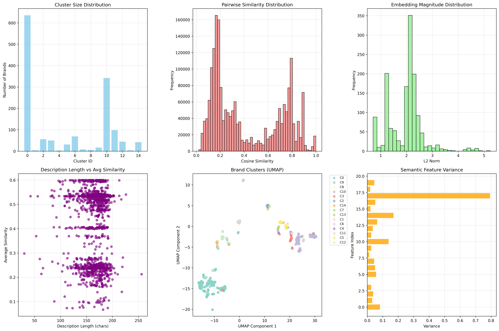

# 🚀 ファッションブランド類似度分析

LLMでファッション説明文を生成し、ブランド間の類似度を分析・可視化するシステム。

**結果例:** シャネル → ディオール (0.95), ルイ・ヴィトン (0.92)

## 🛠️ ファイル構成

```
Carlin/
├── make_description.py          # LLM説明文生成
├── brand_similarity.py         # 類似度分析
├── few_shot.py                 # プロンプト設定
├── datasets/bline_similarity/  # データ
├── advanced_results/           # 結果
└── model/                      # LLMモデル
```

## 🚀 実行手順

### 1. 環境準備
```bash
pip install pandas transformers torch scikit-learn umap-learn plotly matplotlib seaborn
```

### 2. LLM説明文生成
```bash
# テスト実行
python make_description.py --mode validation --num_samples 5

# 本番実行
python make_description.py --mode production
```

### 3. 類似度分析
```bash
python brand_similarity.py
```

### 4. 結果確認
- **インタラクティブマップ**: `advanced_results/brand_similarity_landscape.html`
- **分析チャート**: `advanced_results/advanced_analysis.png`

## 📊 結果の見方

### インタラクティブマップの操作
- **ズーム**: マウスホイール
- **移動**: ドラッグ  
- **ブランド名**: 点にホバー
- **グループ選択**: 凡例クリック

### 分析チャートの読み方



#### 📊 **上段（基本統計）**
- **左: クラスター分布** → ブランドグループの大きさ
  - 高い棒 = 多くのブランドが属するメジャーなカテゴリ
  - 低い棒 = 少数精鋭のニッチなカテゴリ
  
- **中央: 類似度分布** → ブランド同士がどれだけ似ているか
  - 左の山 = 似ていないブランド同士
  - 右の山 = 似ているブランド同士
  - **理想的**: 2つの山に分かれる（明確に区別できている）

- **右: 特徴ベクトルの大きさ** → データの安定性
  - 中央に集中 = 安定した分析結果

#### 📍 **下段（詳細分析）**
- **左: 説明文の長さ vs 類似度** → 分析の公平性チェック
  - 横一線 = 説明文が長くても短くても公平に分析
  
- **中央: ブランドマップ** → 実際の配置
  - 同じ色のエリア = 似たブランドのグループ
  - 例: 水色エリア（下）にファストファッション、黄色エリア（上）に高級ブランド

- **右: 重要な特徴** → 何で判断しているか
  - 長い棒 = よく使われる重要な判断基準
  - Innovation（革新性）、Japanese（日本性）などが重要

## 🎯 活用例

### 競合分析
1. 自社ブランドをマップで探す
2. 周辺ブランドが直接競合（類似度0.8+）

### 市場機会
1. ブランド密度の低いエリアを発見
2. 未開拓市場として検討

### ポジショニング
1. 目標ブランドとの距離を測定
2. 移動戦略を策定

## ⚙️ 設定調整

```bash
# より創造的な生成
python make_description.py --temperature 0.6

# より保守的な生成
python make_description.py --temperature 0.2

# メモリ節約
python make_description.py --quantize 8bit
```

## 📈 改善予定

1. **Webダッシュボード**: ブラウザで簡単操作
2. **リアルタイム検索**: 即座に類似ブランド表示  
3. **多言語対応**: 英語・中国語ブランド

---

**💡 1400+ファッションブランドの関係性を一目で把握**